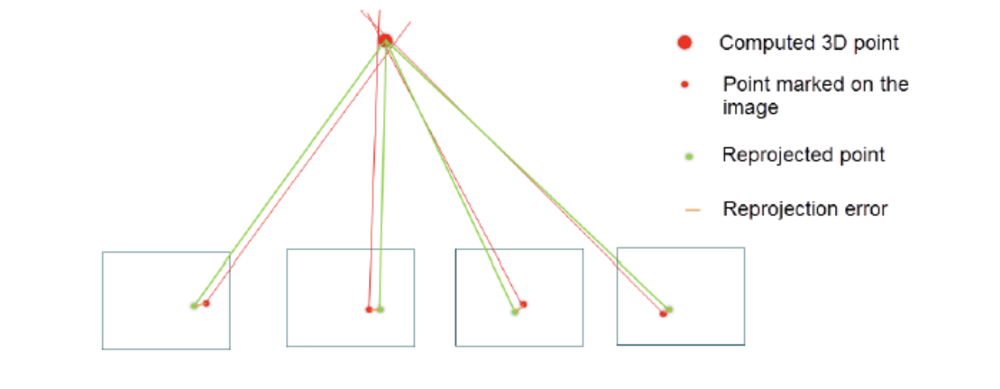
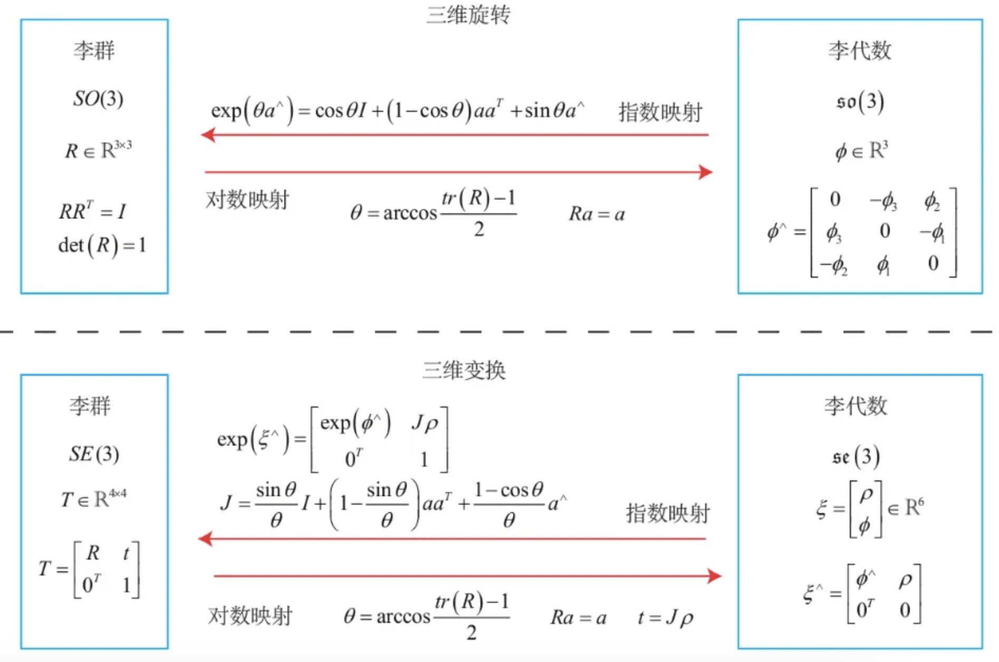

# Bundle Adjustment

---
## 问题定义

**优化变量**

设空间中的 3D 点集合为:

$$
X=\{X_1,X_2,\dots,X_N\},\qquad X_i\in\mathbb{R}^3
$$

设相机位姿集合为:

$$
T=\{T_1,T_2,\dots,T_M\}
$$

其中每个相机位姿写成:

$$
T_j=
\begin{bmatrix}
R_j & t_j\\
0^\top & 1
\end{bmatrix}
$$

并满足:

$$
R_j^\top R_j=I,\qquad \det(R_j)=1,\qquad t_j\in\mathbb{R}^3
$$

也就是说:

* $R_j$ 是合法旋转矩阵
* $t_j$ 是三维平移
* $T_j$ 是一个刚体变换, 属于 $\mathrm{SE}(3)$

如果外参采用 world $\rightarrow$ camera 的形式, 那么对任意一个 3D 点 $X_i$, 有:

$$
X_{ij}^c = R_jX_i+t_j
$$

这里 BA 真正优化的不是“相机中心点”本身, 而是每一帧相机的位姿 $T_j$。

**观测量**

对于某个固定的 3D 点 $X_i$, 设它被相机集合 $V(i)$ 看到。

在每个相机 $j\in V(i)$ 中, 我们有:

* $u_{ij}\in\mathbb{R}^2$: 该点在第 $j$ 个相机中的像素观测
* $s_{ij}$: 该点投影时对应的深度, 更准确地说是齐次尺度
* $K_j$: 第 $j$ 个相机的内参矩阵

也可以把这些观测记成:

$$
u_i=\{u_{ij}\mid j\in V(i)\},\qquad
s_i=\{s_{ij}\mid j\in V(i)\}
$$

**投影模型**

把 3D 点写成齐次坐标 $\tilde X_i$:

$$
\begin{bmatrix}
X_i\\
1
\end{bmatrix}
$$

那么它在第 $j$ 个相机中的齐次投影为:

$$
\begin{bmatrix}
u'_{ij}\\
v'_{ij}\\
s_{ij}
\end{bmatrix} = 
K_j
\begin{bmatrix}
R_j & t_j
\end{bmatrix}
\begin{bmatrix}
X_i\\
1
\end{bmatrix}
$$

去齐次化以后, 预测像素坐标为:

$$
\begin{bmatrix}
u'_{ij}/s_{ij}\\
v'_{ij}/s_{ij}
\end{bmatrix}=
\pi\!\left(
K_j
\begin{bmatrix}
R_j & t_j
\end{bmatrix}
\begin{bmatrix}
X_i\\
1
\end{bmatrix}
\right)
$$

这里的 $\pi(\cdot)$ 就是去齐次化投影函数。

<figure></figure>

---
## 重投影误差

**单个 3D 点 $X_i$ 的重投影误差**

如果只看某一个 3D 点 $X_i$, 那么它在所有可见相机上的总误差为:

$$
\varepsilon_i(X_i,\{T_j\}) =
\sum_{j\in T}
\left\|
\begin{bmatrix}
u_{ij}\\
v_{ij}
\end{bmatrix} -
\pi\!\left(
K_j
\begin{bmatrix}
R_j & t_j
\end{bmatrix}
\begin{bmatrix}
X_i\\
1
\end{bmatrix}
\right)
\right\|^2 
$$

这就是“单点在多帧上的重投影误差”。

**完整的整体重投影误差**

把所有 3D 点都加起来, 就得到完整的 BA 目标函数:

$$
\min_{\{T_j\},\{X_i\}}
\sum_{i=1}^{N}
\sum_{j\in T}
\left\|
\begin{bmatrix}
u_{ij}\\
v_{ij}
\end{bmatrix} -
\pi\!\left(
K_j
\begin{bmatrix}
R_j & t_j
\end{bmatrix}
\begin{bmatrix}
X_i\\
1
\end{bmatrix}
\right)
\right\|^2
$$

这就是 BA 的核心:

* 优化变量是所有相机位姿 $\{T_j\}$ 和所有 3D 点 $\{X_i\}$
* 目标是让所有观测的重投影误差之和最小

---
## 求解难点

**难点 1: 投影函数是非线性的**

因为投影里有除以深度 $s_{ij}$ 的过程:

$$
(u,v)=\left(\frac{u'}{s_{ij}},\frac{v'}{s_{ij}}\right)
$$

所以残差对变量不是线性的。

**难点 2: 旋转矩阵有硬约束**

相机位姿中的旋转矩阵必须始终满足:

$$
R^\top R=I,\qquad \det(R)=1
$$

如果直接把 $R$ 的 9 个元素当成普通变量去做最小二乘:

* 更新一步后很容易破坏正交性
* 还得强行把它投影回 $SO(3)$
* 数值实现会很别扭

同理, 整个 $T\in SE(3)$ 也带有结构约束。

**难点 3: 位姿和 3D 点是耦合的**

每个残差同时依赖:

* 一个相机位姿
* 一个 3D 点

所以 BA 本质上是一个大规模耦合的非线性最小二乘问题。

这也是为什么下一步要引入李群 / 李代数。

---
## 李群与李代数

**为什么要引入李群 / 李代数**

李群 / 李代数在 BA 里解决的是:

* 如何在最小二乘里无约束地优化位姿
* 同时保证更新后的 $R$ 和 $T$ 依然合法

最核心的想法是:

* 不直接优化旋转矩阵 $R$
* 不直接优化位姿矩阵 $T$
* 而是优化它们在切空间里的小增量

**基本记号**

对旋转:

$$
\phi\in\mathbb{R}^3,\qquad
R=\exp(\phi^\wedge)\in SO(3)
$$

对刚体位姿:

$$
\xi\in\mathbb{R}^6,\qquad
T=\exp(\xi^\wedge)\in SE(3)
$$

其中:

* $\phi$ 是 so(3) 里的旋转向量
* $\xi$ 是 se(3) 里的位姿向量, 一般写成平移 3 维 + 旋转 3 维
* $(\cdot)^\wedge$ 是把向量变成矩阵的“帽子算子”

<figure><figcaption>
SO(3)/SE(3) 与 so(3)/se(3) 的对应关系。优化时在李代数里求小增量, 再通过指数映射回到合法的旋转和位姿矩阵。
</figcaption></figure>

**怎么解决 BA 里的约束难点**

有了李代数参数化以后:

* 优化变量变成 $\xi\in\mathbb{R}^6$, 这是无约束欧式空间
* 更新时再通过指数映射回到 $SE(3)$

也就是说, 位姿更新不写成普通加法:

$$
T\leftarrow T+\Delta T
$$

而是写成流形上的更新:

$$
T\leftarrow \exp(\Delta\xi^\wedge)T
$$

这样更新之后, 新的 $T$ 仍然自动是合法的 $\mathrm{SE}(3)$ 元素。

---
## 完整推导过程

**Step 1: 用李代数重新参数化**

把位姿变量写成:

$$
T_j(\xi_j)=\exp(\xi_j^\wedge)
$$

于是每个观测残差可以写成:

$$
r_{ij}(\xi_j,X_i)
=
u_{ij}
-
\pi\!\left(
K_j
\begin{bmatrix}
R(\xi_j) & t(\xi_j)
\end{bmatrix}
\tilde X_i
\right)
$$

整个目标函数变成:

$$
\min_{\{\xi_j\},\{X_i\}}
\sum_{i=1}^{N}
\sum_{j\in V(i)}
\|r_{ij}(\xi_j,X_i)\|^2
$$

**Step 2: 在当前估计附近线性化**

把所有变量堆叠成一个大向量:

$$
\Theta=
\begin{bmatrix}
\xi_1^\top & \cdots & \xi_M^\top & X_1^\top & \cdots & X_N^\top
\end{bmatrix}^\top
$$

把所有残差也堆起来记成 $r(\Theta)$。

在当前估计点附近做一阶泰勒展开:

$$
r(\Theta+\Delta\Theta)
\approx
r(\Theta)+J\Delta\Theta
$$

其中:

$$
J=\frac{\partial r}{\partial \Theta}
$$

这一步就是把原来的非线性问题局部近似成一个线性最小二乘问题。

**Step 3: 求解线性化后的最小二乘**

线性化后, 我们要求:

$$
\min_{\Delta\Theta}
\|r+J\Delta\Theta\|^2
$$

Gauss-Newton 对应的正规方程为:

$$
(J^\top J)\Delta\Theta=-J^\top r
$$

如果用 Levenberg-Marquardt, 则会写成:

$$
(J^\top J+\lambda I)\Delta\Theta=-J^\top r
$$

其中 $\lambda$ 是阻尼系数。

**Step 4: 更新变量**

求出增量以后:

对 3D 点做普通加法更新:

$$
X_i \leftarrow X_i+\Delta X_i
$$

对相机位姿做李群更新:

$$
T_j \leftarrow \exp(\Delta\xi_j^\wedge)T_j
$$

这一步正是李群 / 李代数在 BA 里的核心作用。

**Step 5: 重复迭代直到收敛**

常见停止条件有:

* $\|\Delta\Theta\|$ 已经很小
* 重投影误差下降不明显
* 达到最大迭代次数

所以 BA 的完整求解流程就是:

1. 给定初值
2. 写出重投影残差
3. 用李代数参数化位姿
4. 在当前点附近线性化
5. 解线性最小二乘得到增量
6. 用指数映射更新位姿, 用加法更新 3D 点
7. 迭代到收敛

---
## 总结

BA 的逻辑主线可以概括成:

* 先定义 3D 点和相机位姿
* 再写出单点的重投影误差
* 然后把所有点的误差加起来得到整体目标
* 接着发现难点在于非线性和位姿约束
* 最后用李群 / 李代数把位姿优化变成无约束增量优化

因此 BA 本质上就是:

$$
\text{在合法位姿约束下, 联合优化相机和 3D 点, 使整体重投影误差最小。}
$$
