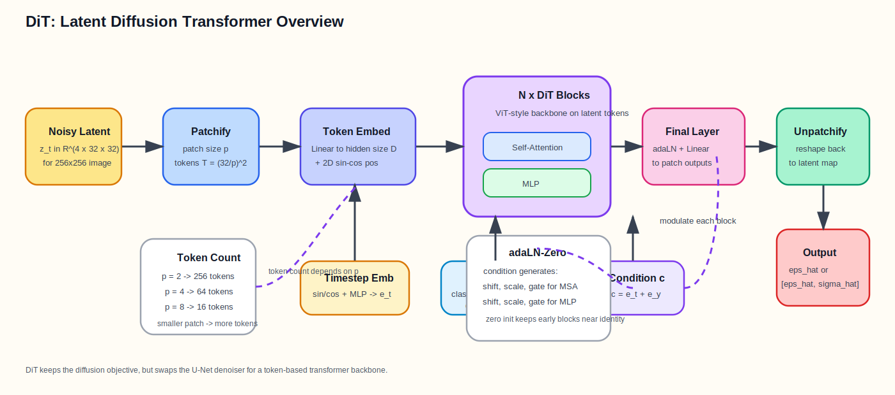

# DiT

<!-- ############################### -->
## Overview

DiT 的全称是 **Diffusion Transformer**。  
它不是一个新的 diffusion 训练框架, 而是把 diffusion model 里面原本常见的 **U-Net denoiser** 换成了 **Transformer denoiser**。

所以如果把整个系统看成:

$$
(\mathbf{x}_t,t,\mathbf{c})\longrightarrow \hat{\epsilon}
$$

那么 DiT 改的主要是中间这个“去噪网络”:

* 传统 latent diffusion: 常用 U-Net
* DiT: 改成 ViT 风格的 Transformer backbone

---
**DiT 最核心的想法**

不是直接对像素图片做 patchify, 而是先沿用 latent diffusion 的做法:

1. 先把图像编码成 latent
2. 在 latent 上加噪
3. 再把 noisy latent 切成 patch tokens
4. 用 Transformer 预测噪声

可以写成:

$$
\mathbf{x}_0 \xrightarrow{E} \mathbf{z}_0
\xrightarrow{\text{forward diffusion}} \mathbf{z}_t
\xrightarrow{\text{DiT}_\theta(\cdot,t,\mathbf{c})}
\hat{\epsilon}
$$

其中:

* $\mathbf{x}_0$: 原始图像
* $E$: VAE encoder
* $\mathbf{z}_0$: 干净 latent
* $\mathbf{z}_t$: 第 $t$ 步的 noisy latent
* $\mathbf{c}$: 条件信息, 在原始 DiT 论文里主要是类别标签 $y$
* $\hat{\epsilon}$: 预测噪声

---
**和 U-Net diffusion 最重要的区别**

U-Net 更像:

* feature map 在不同分辨率之间上下采样
* 靠 encoder-decoder + skip connection 做多尺度建模

DiT 更像:

* 先把 latent 切成 token
* 后面一直在 token 序列上做 Transformer block
* 不再显式做 U 形的多尺度结构

所以 DiT 的 backbone 更接近 ViT:

$$
\text{Patchify}
\rightarrow
\text{Token Embedding}
\rightarrow
\text{Transformer Blocks}
\rightarrow
\text{Linear Head}
\rightarrow
\text{Unpatchify}
$$

---
**整体流程**

1. 输入图像先被 VAE 编码成 latent $\mathbf{z}_0$
2. 给 latent 加噪得到 $\mathbf{z}_t$
3. 把 noisy latent 切成 patch, 每个 patch 映射成 token
4. 加上 2D position embedding
5. 把 timestep embedding 和 class embedding 合成条件向量 $\mathbf{c}$
6. token 依次通过 $N$ 个 DiT blocks
7. 输出 token 再被线性映射回 patch 像素块
8. unpatchify 回到 latent 形状, 得到 $\hat{\epsilon}$ 或 $(\hat{\epsilon},\hat{\sigma})$

---
**一个最常用的函数表达**

在原始 DiT 里, backbone 可以写成:

$$
\mathrm{DiT}_\theta:(\mathbf{z}_t,t,y)\longrightarrow \hat{\epsilon}
$$

如果采用 `learn_sigma=True`, 官方实现里输出其实是:

$$
\mathrm{DiT}_\theta:(\mathbf{z}_t,t,y)\longrightarrow [\hat{\epsilon},\hat{\sigma}]
$$

也就是通道数会翻倍。

<!-- ############################### -->
## Paper Figures

<figure><figcaption>DiT 项目页里的核心结构图: 左边是整体 latent diffusion transformer, 右边比较了三种条件注入方式, 其中效果最好的是 adaLN-Zero。</figcaption></figure>

### 图 1 图解

这张图最重要的其实不是“Transformer 能做 diffusion”,  
而是作者在比较: **条件信息应该怎么注入 Transformer block**。

它对比了 3 种方案:

1. `adaLN-Zero`
   用条件向量去调制 LayerNorm 后的特征, 同时还控制残差分支的 gate
2. `cross-attention`
   像很多 text-to-image 模型那样, 通过 cross-attention 注入条件
3. `in-context conditioning`
   把条件也拼成 token, 直接跟图像 token 一起送进 Transformer

论文结论是:

* 对 DiT 这种 class-conditional latent diffusion 来说
* **adaLN-Zero 最简单, 但效果最好**

左边总图则说明了 DiT 的主干:

* 输入不是 RGB 图像, 而是 `32 x 32 x 4` 这样的 noisy latent
* 先 patchify 成 token
* 然后过很多个 DiT blocks
* 最后线性映射并 reshape 回 latent 形状

---

<figure><figcaption>DiT 项目页里的 scaling 图: 增大模型规模或增加 token 数量, 都会持续提升 FID。</figcaption></figure>

### 图 2 图解

这张图想说的是 DiT 的一个核心优点: **好扩展**。

它主要沿两个方向扩展:

* 模型变大: `S -> B -> L -> XL`
* token 变多: patch size 从 `/8 -> /4 -> /2`

这里 `/2` 的意思是 patch size = 2。  
patch 越小, token 越多, attention 计算量就越大。

图里的现象非常一致:

* 更大的模型, FID 更低
* 更小的 patch size, FID 也更低
* 说明对 DiT 来说, **GFLOPs 比单纯参数量更关键**

这点很像很多 Transformer 系统里的 scaling law:

* 不是“参数多就一定最好”
* 而是“计算量和 token 数一起放大”通常更有效

---

<figure><figcaption>按 DiT 论文和官方实现整理的流程示意图: noisy latent 先 patchify 成 token, 条件通过 adaLN-Zero 注入每个 block, 最后再 unpatchify 回 latent 噪声预测。</figcaption></figure>

### 图 3 图解

这张图可以抓 5 个关键词:

* `latent`: DiT 不是直接处理像素图, 而是处理 VAE latent
* `patchify`: 把二维 latent 切成 token 序列
* `Transformer`: 主干是重复堆叠的 ViT 风格 block
* `adaLN-Zero`: 时间步和类别条件不是拼在输入图上, 而是调制每一层
* `unpatchify`: 输出还是要回到原 latent 的空间形状

如果只记一个区别:

* U-Net diffusion 是“特征图 backbone”
* DiT 是“token backbone”

<!-- ############################### -->
## Step 1: Image 到 Latent

DiT 论文本质上是一个 **latent diffusion model**。  
所以它并不是直接对原始图像做 diffusion, 而是先过一个 VAE。

### 输入

* 图像 `x0`: $(N,3,H,W)$

### 1. VAE 编码

先通过 encoder:

$$
\mathbf{z}_0=E(\mathbf{x}_0)
$$

对于原始 DiT 论文里常见的设置:

* 图像分辨率 `256 x 256`
* VAE 下采样倍数为 `8`

所以 latent 形状通常会变成:

* `x0`: $(N,3,256,256)$
* `z0`: $(N,4,32,32)$

这里:

* 空间尺寸缩小了 $8\times$
* 通道数变成了 `4`

### 2. 为什么先去 latent 空间

因为如果直接在像素空间上做 patch attention:

* token 会非常多
* self-attention 代价太高

而先压到 latent 空间后:

* token 数大幅下降
* 模型还能保留主要语义结构

所以 DiT 的高效前提其实不是“Transformer 本身更省”, 而是:

* **Transformer + latent diffusion** 这个组合让它变得可训练

### 输出

* `z0`: $(N,4,h,w)$

---

## Step 2: Forward Diffusion on Latent

DiT 的加噪过程和普通 diffusion 没有本质区别,  
只是对象从图像 $\mathbf{x}$ 换成了 latent $\mathbf{z}$。

### 输入

* 干净 latent `z0`: $(N,4,h,w)$
* timestep `t`
* noise schedule

### 1. 前向加噪

$$
\mathbf{z}_t=
\sqrt{\bar{\alpha}_t}\mathbf{z}_0+
\sqrt{1-\bar{\alpha}_t}\epsilon,
\quad
\epsilon\sim\mathcal N(\mathbf{0},I)
$$

这和普通 DDPM 的公式完全一样, 只是变量名换了。

### 2. 训练时真正送给 DiT 的输入

模型真正看到的不是干净 latent, 而是:

* noisy latent $\mathbf{z}_t$
* 当前 timestep $t$
* 条件标签 $y$

也就是:

$$
(\mathbf{z}_t,t,y)
$$

### 输出

* `zt`: $(N,4,h,w)$

---

## Step 3: Patchify Latent

这一步是 DiT 和 U-Net 最大的分叉点。  
U-Net 直接把 latent 当二维 feature map 处理;  
DiT 则先把它切成 patch token。

### 输入

* noisy latent `zt`: $(N,C,h,w)$
* patch size $p$

原始 DiT 常见设置里:

* $C=4$
* $h=w=32$
* $p\in\{2,4,8\}$

### 1. 切 patch

把 latent 按 $p\times p$ 切块后, token 数量是:

$$
T=\frac{h}{p}\cdot \frac{w}{p}
$$

每个 patch 展平成一个向量:

$$
\mathbf{u}_i\in\mathbb{R}^{p^2C}
$$

所以:

* 当 $p=2$ 时, $T=16\times16=256$
* 当 $p=4$ 时, $T=8\times8=64$
* 当 $p=8$ 时, $T=4\times4=16$

### 2. 线性映射成 token embedding

每个 patch 再通过线性层映射到 hidden size $D$:

$$
\mathbf{x}_i=W_e\mathbf{u}_i+b_e,\quad \mathbf{x}_i\in\mathbb{R}^{D}
$$

批量后:

$$
\mathbf{X}\in\mathbb{R}^{N\times T\times D}
$$

在官方实现里这个层对应 `PatchEmbed`。

### 3. 加二维位置编码

DiT 使用固定的 2D sin-cos positional embedding:

$$
\mathbf{X}\leftarrow \mathbf{X}+\mathbf{P}
$$

其中:

* `X`: $(N,T,D)$
* `P`: $(1,T,D)$

这一步的目的很直接:

* patch token 自己只知道“内容”
* position embedding 告诉它“自己来自 latent 的哪里”

### 输出

* `tokens`: $(N,T,D)$

---

## Step 4: Timestep Embedding 和 Label Embedding

Transformer 不仅要知道 token 内容, 还必须知道:

* 当前噪声有多重
* 要生成哪一类图像

### 输入

* timestep `t`: $(N,)$
* label `y`: $(N,)$

### 1. Timestep embedding

先对 $t$ 做 sinusoidal embedding, 再过一个 MLP:

$$
\mathbf{e}_t=\mathrm{MLP}(\mathrm{PE}(t))
$$

得到:

$$
\mathbf{e}_t\in\mathbb{R}^{N\times D}
$$

### 2. Label embedding

类别标签也会查 embedding table:

$$
\mathbf{e}_y=\mathrm{Embed}(y)\in\mathbb{R}^{N\times D}
$$

### 3. CFG 训练里的 label dropout

官方实现里 `LabelEmbedder` 还会做 label dropout。  
也就是训练时随机把一部分 label 替换成一个特殊的“空条件”标签:

* 有条件样本学会按类别生成
* 无条件样本学会不依赖类别生成

这样推理时就能做 classifier-free guidance。

### 4. 合成条件向量

原始 DiT 里最简单直接的做法是:

$$
\mathbf{c}=\mathbf{e}_t+\mathbf{e}_y
$$

其中:

* `c`: $(N,D)$

这个 $\mathbf{c}$ 后面会拿去调制每一个 DiT block。

### 输出

* `c`: $(N,D)$

---

## Step 5: DiT Block with adaLN-Zero

这是 DiT 里最关键的一步。  
如果只说一句话, 那就是:

> DiT block 本质上是一个 ViT block, 但每层都会被条件向量 $\mathbf{c}$ 动态调制。

### 输入

* token `x`: $(N,T,D)$
* condition `c`: $(N,D)$

### 1. 标准 ViT block 长什么样

一个普通的 Transformer / ViT block 通常写成:

$$
\mathbf{x}=\mathbf{x}+\mathrm{MSA}(\mathrm{LN}(\mathbf{x}))
$$

$$
\mathbf{x}=\mathbf{x}+\mathrm{MLP}(\mathrm{LN}(\mathbf{x}))
$$

也就是:

* 先 LayerNorm
* 再 self-attention
* 再残差相加
* 然后再过一次 MLP 残差

### 2. DiT 怎么把条件注入进来

DiT 不直接把条件拼成 token, 而是让条件向量 $\mathbf{c}$ 生成 6 组调制参数:

$$
(\beta_1,\gamma_1,\alpha_1,\beta_2,\gamma_2,\alpha_2)
=
\mathrm{MLP}(\mathbf{c})
$$

其中每一项都是 $(N,D)$。

然后定义一个自适应 LayerNorm:

$$
\mathrm{adaLN}(\mathbf{x};\beta,\gamma)=
\mathrm{LN}(\mathbf{x})\odot(1+\gamma)+\beta
$$

于是 block 变成:

$$
\mathbf{x}'=
\mathbf{x}+
\alpha_1\odot
\mathrm{MSA}(
\mathrm{adaLN}(\mathbf{x};\beta_1,\gamma_1)
)
$$

$$
\mathbf{x}''=
\mathbf{x}'+
\alpha_2\odot
\mathrm{MLP}(
\mathrm{adaLN}(\mathbf{x}';\beta_2,\gamma_2)
)
$$

这里:

* $\beta$: shift
* $\gamma$: scale
* $\alpha$: residual gate

### 3. 为什么叫 adaLN-Zero

名字里有两个重点:

* `adaLN`: 用条件向量自适应地调制 LayerNorm
* `Zero`: 这些调制层和输出层会做零初始化

官方实现里会把:

* block 里的 modulation 线性层
* final layer 的 modulation
* final output linear

都初始化为 0。

这样训练刚开始时:

* 每个 block 近似 identity
* 优化更稳定

这和很多 residual diffusion 模型里“最后一层置零”的思路是相通的。

### 4. 和 cross-attention 的区别

如果是 text-to-image U-Net, 很常见的是:

* 图像特征做 query
* 文本特征做 key/value
* 用 cross-attention 注入条件

而原始 DiT 论文场景是 class-conditional ImageNet,  
条件本来就只是一个类别 embedding。  
这时候用 adaLN-Zero 会更轻量、也更自然。

### 输出

* `x_out`: $(N,T,D)$

---

## Step 6: Stacked Transformer Backbone

单个 DiT block 只是一个条件化的 Transformer block。  
真正的 backbone 是把它堆叠很多层。

### 输入

* `tokens`: $(N,T,D)$
* `c`: $(N,D)$

### 1. 多层堆叠

如果有 $L$ 层 block:

$$
\mathbf{X}^{(l+1)}=
\mathrm{DiTBlock}_l(\mathbf{X}^{(l)},\mathbf{c}),
\quad l=1,\dots,L
$$

最后得到:

$$
\mathbf{X}^{(L)}\in\mathbb{R}^{N\times T\times D}
$$

### 2. 为什么这里不需要 U 形结构

因为 DiT 的信息交互方式不是依赖上下采样路径, 而是:

* 每个 token 都能和其他 token 做 self-attention
* 全局上下文从一开始就可以直接交互

它牺牲掉的是卷积/U-Net 的强归纳偏置,  
换来的是:

* 更统一的 backbone
* 更直接的全局建模
* 更像 ViT 一样的 scaling 行为

### 3. 注意力代价为什么和 patch size 强相关

self-attention 的复杂度通常和 token 数 $T$ 近似平方相关:

$$
\mathcal O(T^2D)
$$

而:

$$
T=\frac{hw}{p^2}
$$

所以 patch size 越小:

* token 越多
* attention 越贵
* 但性能往往越好

这就是为什么 `XL/2` 会比 `XL/8` 强很多,  
即使两者参数规模很接近。

### 输出

* `hidden_tokens`: $(N,T,D)$

---

## Step 7: Final Layer 和 Unpatchify

Transformer 主干输出的还是 token。  
但 diffusion 训练目标要求我们输出和 latent 同形状的噪声图。  
所以最后必须把 token 重新拼回二维 latent。

### 输入

* `hidden_tokens`: $(N,T,D)$
* `c`: $(N,D)$

### 1. Final adaptive layer norm

官方实现里最后还有一个条件化输出层:

$$
\mathbf{h}=
\mathrm{adaLN}_{final}(\mathbf{X}^{(L)},\mathbf{c})
$$

### 2. 线性投影回 patch

每个 token 被映射回一个 patch 向量:

$$
\mathbf{o}_i\in\mathbb{R}^{p^2C_{out}}
$$

其中:

* 如果只预测噪声, $C_{out}=C$
* 如果同时预测噪声和方差, $C_{out}=2C$

批量后:

$$
\mathbf{O}\in\mathbb{R}^{N\times T\times p^2C_{out}}
$$

### 3. Unpatchify

再把这些 patch 按原空间位置拼回去:

$$
\mathbf{O}\rightarrow \hat{\mathbf{z}}\in\mathbb{R}^{N\times C_{out}\times h\times w}
$$

对于 `256x256` 图像对应的 latent:

* 输入 latent: `(N,4,32,32)`
* 若 `learn_sigma=False`, 输出: `(N,4,32,32)`
* 若 `learn_sigma=True`, 输出: `(N,8,32,32)`

### 输出

* `eps_hat` 或 `[eps_hat, sigma_hat]`

---

## Step 8: Training Objective

DiT 的训练目标并没有发明一套新的 diffusion loss。  
它继承的仍然是 latent diffusion / DDPM 这条路线。  
真正变的是 **denoiser 参数化方式**。

### 输入

* `z0`: 干净 latent
* `t`: timestep
* `y`: class label
* `noise`: 高斯噪声

### 1. 构造 noisy latent

$$
\mathbf{z}_t=
\sqrt{\bar{\alpha}_t}\mathbf{z}_0+
\sqrt{1-\bar{\alpha}_t}\epsilon
$$

### 2. 模型预测

$$
\hat{\epsilon}=\mathrm{DiT}_\theta(\mathbf{z}_t,t,y)
$$

### 3. 噪声回归损失

最直观的训练目标可以写成:

$$
L=
\mathbb E
\left[
\left\|
\epsilon-\hat{\epsilon}
\right\|_2^2
\right]
$$

如果模型还学习方差, 训练时会包含相应的 variance 项或 hybrid objective。  
但对理解 DiT 主干本身来说, 抓住“它是一个 conditional denoiser”就够了。

### 输出

* `loss`: 标量

---

## Step 9: Classifier-Free Guidance

原始 DiT 是 class-conditional 模型, 所以推理时常配合 CFG。

### 1. 训练阶段怎么为 CFG 做准备

通过前面说的 label dropout:

* 一部分 batch 用真实 label
* 一部分 batch 用空 label

这样模型就同时学会:

* conditional prediction
* unconditional prediction

### 2. 推理阶段的 CFG 公式

$$
\hat{\epsilon}_{cfg}
=
\hat{\epsilon}_{uncond}
+
s(\hat{\epsilon}_{cond}-\hat{\epsilon}_{uncond})
$$

其中:

* $s$: guidance scale

它的直觉和普通 diffusion 里完全一样:

* scale 更大: 类别一致性更强
* 但也可能让样本多样性下降、图像更僵

---

## Step 10: Model Scaling

DiT 论文很重要的一部分其实不是“Transformer 也能做 diffusion”,  
而是它系统地展示了 DiT 的 scaling 行为。

### 1. 模型家族

官方实现里常见配置是:

* `DiT-S`: depth = 12, hidden size = 384, heads = 6
* `DiT-B`: depth = 12, hidden size = 768, heads = 12
* `DiT-L`: depth = 24, hidden size = 1024, heads = 16
* `DiT-XL`: depth = 28, hidden size = 1152, heads = 16

### 2. patch size 配置

每个模型又有:

* `/2`
* `/4`
* `/8`

这三个版本, 指的是 patch size。

例如 `DiT-XL/2` 的意思就是:

* XL 规模的 Transformer
* patch size = 2

### 3. 为什么 `/2` 往往最好

因为 `/2` token 最多:

* 对 `32x32` latent 来说, token 数是 `256`
* attention 看到的空间划分更细
* 计算量也最大

所以 DiT 论文一个很重要的经验结论是:

* **随着 GFLOPs 增加, DiT 的 FID 会持续下降**

这比很多卷积 backbone 更像标准 Transformer 的 scaling 行为。

### 4. 参数量和计算量不是一回事

这一点很容易被忽略:

* 改 `S/B/L/XL` 会改变深度和宽度, 参数量变大
* 改 `/8 /4 /2` 会主要改变 token 数, 大幅改变计算量

所以 DiT 论文强调的是:

* **forward-pass complexity / GFLOPs** 比单看参数量更能解释性能变化

---

## DiT 和 U-Net 的对比

### 相同点

* 都是在做 diffusion denoiser
* 都接收 noisy latent、timestep 和条件信息
* 都输出噪声预测

### 不同点

**U-Net**

* 二维卷积 backbone
* 显式多尺度 encoder-decoder
* skip connection 很强

**DiT**

* token 化后的 Transformer backbone
* 不做 U 形多尺度结构
* 条件通过 adaLN-Zero 注入 block

### DiT 的优点

* 结构更统一, 更接近标准 Transformer
* 全局建模更直接
* scaling 行为更好

### DiT 的代价

* attention 对 token 数更敏感
* 必须依赖 latent 空间来压低计算成本
* 相比卷积, 归纳偏置更弱

---

## 最常用的几个公式放在一起

### 1. latent 加噪

$$
\mathbf{z}_t=
\sqrt{\bar{\alpha}_t}\mathbf{z}_0+
\sqrt{1-\bar{\alpha}_t}\epsilon
$$

### 2. patch token 数

$$
T=\frac{h}{p}\cdot\frac{w}{p}
$$

### 3. 条件向量

$$
\mathbf{c}=\mathbf{e}_t+\mathbf{e}_y
$$

### 4. adaLN

$$
\mathrm{adaLN}(\mathbf{x};\beta,\gamma)=
\mathrm{LN}(\mathbf{x})\odot(1+\gamma)+\beta
$$

### 5. DiT block

$$
\mathbf{x}'=
\mathbf{x}+
\alpha_1\odot
\mathrm{MSA}(\mathrm{adaLN}(\mathbf{x};\beta_1,\gamma_1))
$$

$$
\mathbf{x}''=
\mathbf{x}'+
\alpha_2\odot
\mathrm{MLP}(\mathrm{adaLN}(\mathbf{x}';\beta_2,\gamma_2))
$$

### 6. 最终预测

$$
\hat{\epsilon}=\mathrm{DiT}_\theta(\mathbf{z}_t,t,y)
$$

### 7. CFG

$$
\hat{\epsilon}_{cfg}
=
\hat{\epsilon}_{uncond}
+
s(\hat{\epsilon}_{cond}-\hat{\epsilon}_{uncond})
$$

<!-- ############################### -->
## 一句话总结

DiT 的本质可以理解成:

* **保留 latent diffusion 的训练/采样框架**
* **把 U-Net backbone 换成 patch-token Transformer**
* **再用 adaLN-Zero 把 timestep 和条件信息注入每一个 block**

如果只记一句最重要的话:

> DiT = latent diffusion + ViT-style backbone + adaLN-Zero conditioning。
