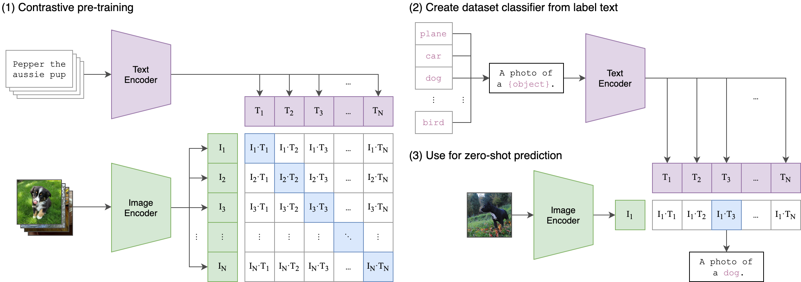

# CLIP

CLIP 是 OpenAI 提出的一个 **图文联合表示模型**。你可以先把它理解成：

> **把图片和文本都映射到同一个特征空间里的模型。**

这样一来，一张图和一句话如果语义相近，它们在这个空间里的向量就会靠近。

<figure><figcaption></figcaption></figure>

***

比如：

* 文本：`a red car`
* 图片：一张红色汽车的图

CLIP 会分别算出：

* 这句话的一个向量
* 这张图的一个向量

如果它们语义匹配，这两个向量就会很接近。\
如果文本换成 `a dog`，那和红车图片的向量距离通常就会更远。

所以 CLIP 的能力本质上是：

* **理解图片内容**
* **理解文本语义**
* **把两者对齐**

***

它是在大量 **图片-文本对** 上训练的。

训练目标大致是：

* 正确配对的图片和文字，特征要靠近
* 不匹配的图片和文字，特征要拉远

这叫 **contrastive learning（对比学习）**。

所以它学到的不是固定类别，而是一种更通用的语义对齐能力

***

CLIP 的训练流程可以概括成一句话：

> **拿大量“图片-文本对”，分别编码图片和文本，然后让匹配的图文特征靠近，不匹配的图文特征远离。**

它本质上是一个 **双塔对比学习**。

1\. 整体结构

CLIP 有两个编码器：

* **Image Encoder**：编码图片
* **Text Encoder**：编码文本

输入是一批图文对：

* ((I\_1, T\_1))
* ((I\_2, T\_2))
* ...
* ((I\_N, T\_N))

其中 (I\_i) 是图片，(T\_i) 是和它配对的文本描述。

经过编码器后得到：

* 图片特征 (v\_i)
* 文本特征 (t\_i)

然后通常再做一次归一化，变成单位向量，方便后面算相似度。


2\. 训练目标到底是什么

训练时并不是做传统分类，比如“这是猫狗车”。

而是做这个任务：

> 在一个 batch 里，给定一张图，应该找到和它配对的那句文本；\
> 给定一句文本，也应该找到和它配对的那张图。

所以它其实同时在学两个检索任务：

* **image-to-text**
* **text-to-image**

***

3\. 一个 batch 里发生了什么

假设一个 batch 有 (N) 对图文：

$$(I_1,T_1), (I_2,T_2), \dots, (I_N,T_N)$$

先分别编码：

$$v_i = f_{\text{img}}(I_i), \quad t_i = f_{\text{text}}(T_i)$$

然后算所有图片和所有文本之间的相似度矩阵：

$$S_{ij} = \frac{v_i^\top t_j}{\tau}$$

这里：

* (v\_i^\top t\_j) 表示图 (i) 和文本 (j) 的相似度
* (\tau) 是 temperature 参数，用来调节 softmax 的尖锐程度

所以你可以得到一个 (N \times N) 的矩阵。

如果第 (i) 张图和第 (i) 条文本是正确配对，那么理想情况下：

* (S\_{ii}) 应该大
* (S\_{ij})（(j \neq i)）应该小


4\. 损失函数怎么做

CLIP 用的是一种 **对称的对比损失**。

### 从图片找文本

把每一行看成：

* 固定一张图 (I\_i)
* 在所有文本里找正确的 (T\_i)

对第 (i) 行做 softmax：

$$p_{ij} = \frac{\exp(S_{ij})}{\sum_{k=1}^{N}\exp(S_{ik})}$$

然后希望正确文本 (j=i) 的概率最大。\
这部分就是一个交叉熵损失。

***

### 从文本找图片

同样，把每一列看成：

* 固定一句文本 (T\_j)
* 在所有图片里找正确的 (I\_j)

再做一次对称的交叉熵损失。

***

### 最终 loss

最终损失通常是两部分平均：

\[\
L = \frac{1}{2}(L\_{\text{img}\to\text{text\}} + L\_{\text{text}\to\text{img\}})\
]

所以它不是只让“图找文”对齐，也让“文找图”对齐。

***

## 5. 这为什么叫对比学习

因为它不是显式告诉模型：

* 这张图是“猫”
* 那张图是“车”

而是告诉模型：

* 这张图和这句话是正样本
* 它和 batch 里其他句子都是负样本

也就是：

* **正样本拉近**
* **负样本推远**

这就是 contrastive learning 的核心。

***

## 6. 文本是怎么处理的

文本先被 tokenizer 切成 token，然后喂给文本 Transformer。

例如：

`a dog running on grass`

会先变成 token 序列，再加位置编码，经过 Transformer，最后得到一句话的向量表示。

通常最后会取某个特殊 token 的输出，或者做 pooling，再映射到共同 embedding 空间。

***

## 7. 图片是怎么处理的

取决于它用的是哪种 image encoder。

### 如果是 ResNet

就是：

* 图片输入 CNN
* 提取全局视觉特征
* 再投影到 embedding 空间

### 如果是 ViT

就是：

* 把图片切成 patch
* 每个 patch 变成 token
* 加位置编码
* 送入 Transformer
* 最后取全局表示，再投影到 embedding 空间

***

## 8. 为什么它能做开放词汇识别

因为它训练的不是固定类别分类器，而是：

> 学一个图像空间和文本空间的对齐关系

所以测试时，即使你不给它训练时那种固定标签，也可以直接写文本：

* “a cat”
* “a red chair”
* “a metallic cup”
* “a person riding a bicycle”

然后把这些文本也编码成向量，和图片向量比相似度。

谁相似度高，就说明图片更像哪个文本描述。

***

## 9. 训练完以后怎么用

训练好后，你有两个编码器：

* image encoder
* text encoder

### 用法 1：图文检索

* 图编码成向量
* 文本编码成向量
* 做相似度匹配

### 用法 2：零样本分类

假设你有类别：

* cat
* dog
* car

就把它们写成 prompt：

* `a photo of a cat`
* `a photo of a dog`
* `a photo of a car`

然后编码这些文本，与图像特征比较相似度，谁最大就预测谁。

### 用法 3：提取视觉语义特征

这是你现在看 3DGS 论文里最常见的用法：

* 输入图像
* 用 CLIP image encoder 抽 feature
* 再把 feature 灌到 3D 表示里

***

## 10. 用一个很小的例子理解

假设一个 batch 里有三对：

1. 图片：狗，文本：`a dog`
2. 图片：汽车，文本：`a car`
3. 图片：苹果，文本：`an apple`

训练时会得到一个相似度矩阵，理想上像这样：

\[\
\begin{bmatrix}\
9 & 1 & 0 \\\
2 & 8 & 1 \\\
0 & 1 & 10\
\end{bmatrix}\
]

对角线大，说明正确匹配高；\
非对角线小，说明错误匹配低。

CLIP 的训练就是不断推动这个矩阵朝“对角线更亮”的方向发展。

***

## 11. 它和传统分类训练的区别

### 传统分类

输入图片，输出固定类别概率：

* cat
* dog
* car

类别集合通常训练前就定死了。

### CLIP

输入图片和文本，学习共同空间：

* 图像不是直接输出标签
* 文本也不是固定标签 id
* 模型学的是语义对齐关系

所以 CLIP 的泛化性更强。

***

## 12. 在你当前语境下，为什么 CLIP 适合 3DGS

因为 3DGS 里如果你想给场景加“语义”，最自然的办法就是：

1. 从 2D 图像抽取语义特征
2. 把这些特征映射到 3D 高斯上

CLIP 正好能提供很强的 2D 语义 embedding，所以它常被用作：

* 语义特征源
* 文本查询对齐源
* open-vocabulary 监督源

***

## 13. 整个流程你可以记成 6 步

### 训练阶段

1. 收集大量图文对
2. 图片进 image encoder
3. 文本进 text encoder
4. 得到图像向量和文本向量
5. 计算 batch 内所有图文两两相似度
6. 用对比损失让正确配对更近、错误配对更远

***

## 14. 一句话版公式理解

CLIP 训练就是在学：

\[\
\text{similarity}(\text{matched image}, \text{matched text}) \uparrow\
]

\[\
\text{similarity}(\text{unmatched image}, \text{unmatched text}) \downarrow\
]

***

## 15. 最后一句总结

你可以把 CLIP 的训练理解成：

> **它不是在学“图片属于哪个固定类”，而是在学“哪张图和哪段文字语义上对应”。**

所以它后面才能被拿来做：

* 图文检索
* 零样本分类
* 开放词汇分割
* 2D 到 3D 的语义迁移

如果你想，我下一条可以继续给你讲 **CLIP 为什么既能输出整图 embedding，又能被很多论文改造成 dense feature map**。

***


```python
import torch
import clip
from PIL import Image

device = "cuda" if torch.cuda.is_available() else "cpu"
model, preprocess = clip.load("ViT-B/32", device=device)

image = preprocess(Image.open("CLIP.png")).unsqueeze(0).to(device)
text = clip.tokenize(["a diagram", "a dog", "a cat"]).to(device)

with torch.no_grad():
    image_features = model.encode_image(image)
    text_features = model.encode_text(text)
    
    logits_per_image, logits_per_text = model(image, text)
    probs = logits_per_image.softmax(dim=-1).cpu().numpy()

print("Label probs:", probs)  # prints: [[0.9927937  0.00421068 0.00299572]]
```

