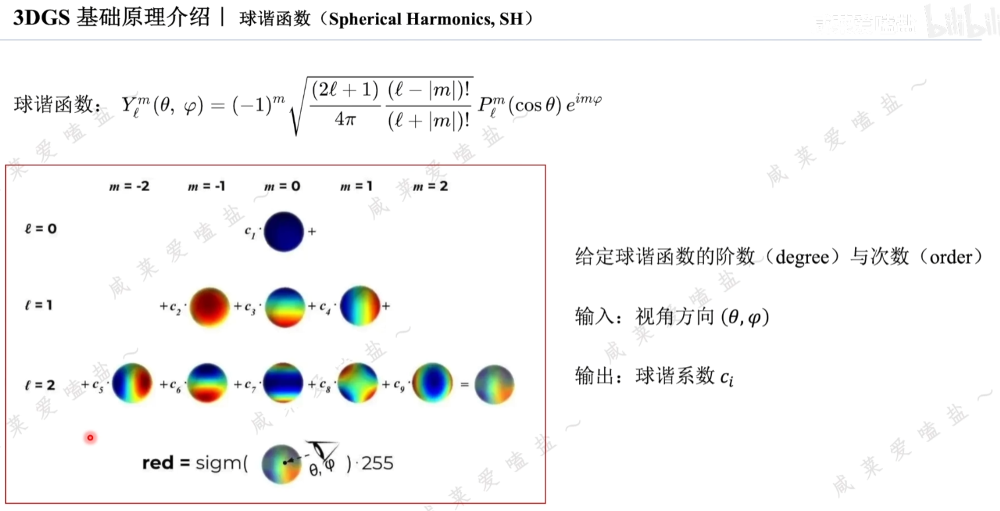
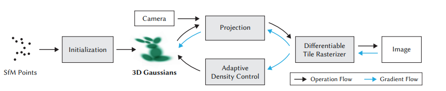
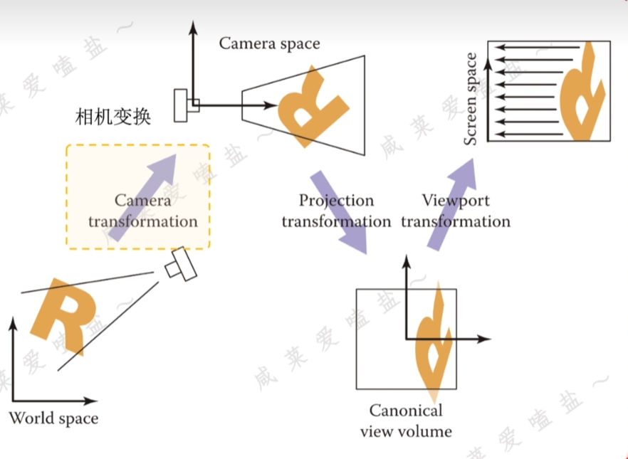
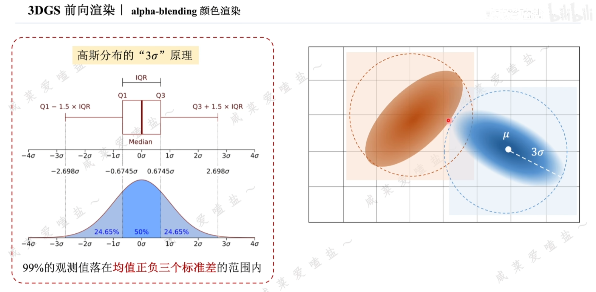
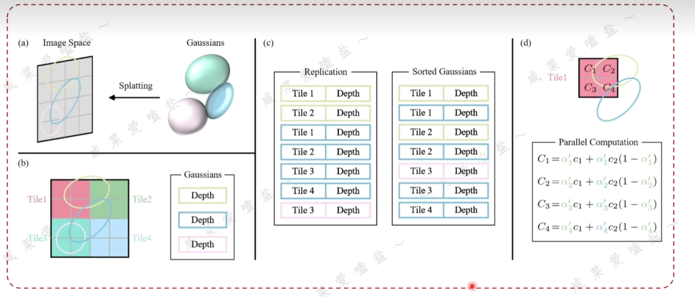
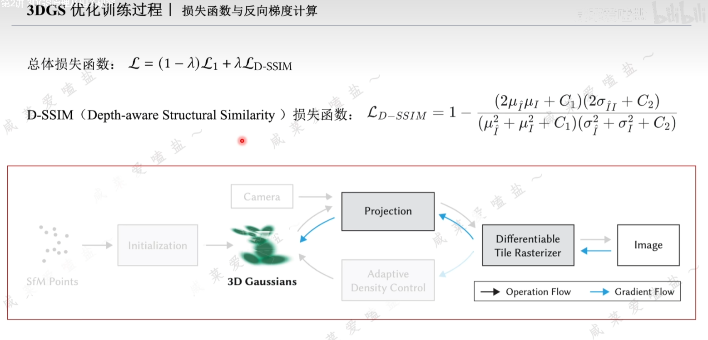
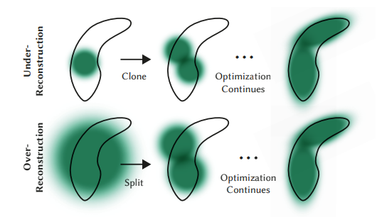
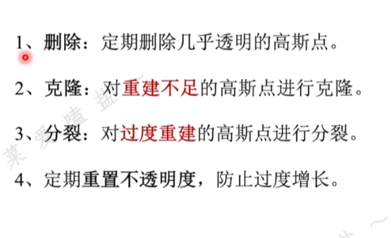

# 3DGS

## referrence

https://www.bilibili.com/video/BV1zi421v7Dr/?spm\_id\_from=333.788.recommend\_more\_video.-1\&trackid=web\_related\_0.router-related-2479604-6dnm7.1773423875441.190\&vd\_source=84ae2dc9d7d25fd8637002a2bb332c48

## background

**主动/被动渲染** NeRF 中的 ray-casting 更接近一种被动渲染: 已知相机位姿后, 从像素出发发射射线, 再沿着射线去查询场景在这些位置的颜色和密度;\
也就是说, 它的前向过程是:

$$
\text{pixel} \rightarrow \text{ray} \rightarrow \text{sample points} \rightarrow \text{color}
$$

这里所谓"被动", 不是说 NeRF 不学习场景, 而是说在渲染时, 每个像素要等着射线去"问"场景: 这条路径上有什么。

3DGS 则更接近主动渲染: 场景先被表示成一堆显式的 3D Gaussian, 渲染时不是沿每条射线反复查询隐式函数, 而是直接计算这些高斯会如何投影到图像平面, 并主动把自己的影响"铺"到像素上:

$$
\text{Gaussians} \rightarrow \text{project to image} \rightarrow \text{splat} \rightarrow \text{image}
$$

所以可以直观理解成:

* NeRF: 从像素出发, 找哪些 3D 位置会影响这个像素
* 3DGS: 从场景中的每个高斯出发, 看它会影响哪些像素

***

**泼溅**

这里的 splatting 可以先把它想成一种"往屏幕上盖印章"的过程。

如果场景里只有一个 3D 点, 投影到图像上往往只对应一个离散像素, 这会很稀疏, 也不稳定;\
而 3DGS 不是把一个元素当作无限小的点, 而是把它当作一个有空间范围的 3D Gaussian。这样它投影到 2D 后, 就不是一个点, 而是一个 2D 椭圆形的影响区域。

于是渲染时做的事情就是:

1. 把 3D Gaussian 投影到当前图像平面
2. 得到它在 2D 上的中心和协方差
3. 对它覆盖到的像素, 按高斯权重分配颜色和透明度
4. 按深度顺序把多个高斯做 alpha blending

这就是 splatting 的核心:\
不是"一个像素只对应一个点", 而是"一个高斯把自己的影响软性地分摊到周围一片像素上"。

这个表示有几个直接好处:

* 比点云 rasterization 更平滑, 不容易出现很多孔洞
* 比 NeRF 沿射线密集采样更高效
* 对反向传播友好, 因为投影、权重、合成过程都可以做成可微

所以 3DGS 常被理解成:\
把 3D 场景表示成一组可以被直接 rasterize 的软粒子, 再用可微 splatting 来渲染。

***

**3D高斯椭球性质**

Gaussian 椭球有非常好的数学性质。

**多维高斯的基本形式**

一个 $k$ 维高斯可以写成:

$$
G(\mathbf{x})=
\frac{1}{\sqrt{(2\pi)^k|\Sigma|}}
\exp\left(
-\frac{1}{2}
(\mathbf{x}-\mu)^T\Sigma^{-1}(\mathbf{x}-\mu)
\right)
$$

在 3DGS 里, $k=3$, 它在空间中的是一个椭球;

其中:

* $\mu$ 是均值, 表示高斯中心
* $\Sigma$ 是协方差矩阵, 决定高斯的尺度、拉伸和朝向
* $|\Sigma|$ 是协方差矩阵的行列式
* $\mathbf{x}$ 是某个点的3维位置; 如果代入这个点到高斯分布里, 就能得到这个这个高斯分布对这个点的影响力 $G(\mathbf{x})$
* $G(\mathbf{x})$ 在 $\[0,1]$ 之间分布, 代表影响; 比如 $\mathbf{x}$ 离高斯椭球很近, 那 $G(\mathbf{x})$ 就会接近1

**仿射变换后仍然保持高斯形式**

这是最关键的性质之一。

如果一个随机变量满足:

$$
\mathbf{x}\sim\mathcal{N}(\mu,\Sigma)
$$

那么经过仿射变换

$$
\mathbf{y}=A\mathbf{x}+\mathbf{b}
$$

之后, 仍然有

$$
\mathbf{y}\sim\mathcal{N}(A\mu+\mathbf{b},A\Sigma A^T)
$$

***

**结论**

* **高斯可以很好的表示一个3维椭球**
* **任何高斯(椭球)都可以看作是由标准高斯(球)通过仿射变换($A\mathbf{x}+\mathbf{b}$)得到**

***

**仿射变换与旋转/缩放矩阵的联系**

**从标准高斯出发**

先从最简单的标准高斯出发, 可以理解为一个处于原点位置的标准大小的圆球:

$$
\mathbf{x}\sim\mathcal{N}(\mathbf{0},I)
$$

这个高斯的$\Sigma$等于单位矩阵$I$; 然后进行进行仿射变换$A\mathbf{x}+\mathbf{b}$, 那么新的协方差就是:

$$
\Sigma=AIA^T
$$

也就是

$$
\Sigma=AA^T
$$

**把仿射变换拆成旋转和缩放**

在 3DGS 里, 通常不会直接优化一个任意的 $A$, 而是把它拆成:

$$
A=RS
$$

其中:

* $R$ 是旋转矩阵, 负责方向
* $S$ 是缩放矩阵, 负责各轴尺度

于是代入上面的协方差公式:

$$
\Sigma=AA^T
$$

得到

$$
\Sigma=(RS)(RS)^T
$$

再利用转置的乘法规则

$$
(RS)^T=S^TR^T
$$

所以最终有:

$$
\Sigma=RSS^TR^T
$$

这就是 3DGS 里常见的协方差参数化形式。

如果 $S$ 是对角矩阵, 那么它通常表示沿主轴方向的缩放;\
再乘上 $R$ 之后, 就把这个轴对齐的椭球旋转到了任意方向。

**结论**

* $R$ 很直观地控制高斯椭球朝向
* $S$ 很直观地控制高斯椭球在各个方向上的大小
* $\Sigma=RSS^TR^T$ 天然是半正定的

所以 3DGS 不需要直接去学一个自由的 $(3,3)$ 协方差矩阵, 而是学:

* 一个旋转矩阵
* 一个缩放矩阵

然后再把它们组合成协方差矩阵。

***

**结论**

* **高斯可以很好的表示一个3维椭球; 高斯均值表示椭球中心, 协方差矩阵显式表示旋转和缩放;**
* **这样在任意位置, 任意形状的椭球, 用高斯就可以完全表示**

***

**球谐函数表达颜色**

<figure><figcaption></figcaption></figure>

## Overview

可以把 3DGS 分成两个层次来看:

1. **训练阶段**: 用多视角图片和相机参数, 学到一组能够表示场景的 3D Gaussians
2. **渲染阶段**: 给定一个目标相机, 把这些 3D Gaussians 投影到 2D 图像平面, 再 splat 成最终图像

<figure><figcaption></figcaption></figure>

和生成点云 渲染点云类似; 只是这里我们的点云比较不一样,需要特殊的获取方法(通过反向传播训练, 但不是深度学习的方式),以及特殊的渲染方法;&#x20;

**训练中的 forward = “可微分渲染”**\
**推理/展示时的 render = “只渲染，不回传梯度”**

## 前向可微渲染: Step1 初始化成高斯场景

输入: 视角图像 以及相机对应位姿; 通过sfm方式先得到稀疏点云; 基于这个点云, 初始化成高斯椭球; 相当于是给场景进行一个高斯表示的初始化

## 前向可微渲染: Step2 坐标变换

这一步描述了一个高斯椭球如何投影到图像上;

<figure><figcaption></figcaption></figure>

对于高斯椭球的均值和协方差矩阵如何变换:&#x20;

相机变换

投影变换; 为什么引入雅可比

视角变换

***

## 前向可微渲染: Step3 **Splatting 和 Alpha 合成**

这一步描述了这些高斯椭球最终是如何叠加渲染一张图片的

<figure><figcaption></figcaption></figure>

记某个像素位置为:

$$
\mathbf{p}=(u,v)^T\in\mathbb{R}^2
$$

那么单个 Gaussian 对这个像素的 2D 权重为:

$$
g_i(\mathbf{p})=
\exp\left(
-\frac{1}{2}
(\mathbf{p}-\mathbf{u}_i)^T
\Sigma_{2D,i}^{-1}
(\mathbf{p}-\mathbf{u}_i)
\right)
$$

再乘上 opacity:

$$
\alpha_i(\mathbf{p})=o_i\cdot g_i(\mathbf{p})
$$

对于同一个像素, 按深度从近到远排序后做 alpha blending:

$$
T_i(\mathbf{p})=\prod_{j<i}\left(1-\alpha_j(\mathbf{p})\right)
$$

$$
\hat{\mathbf{C}}(\mathbf{p})=
\sum_i
T_i(\mathbf{p})\alpha_i(\mathbf{p})\mathbf{c}_i(\mathbf{d})
\in\mathbb{R}^3
$$

把所有像素拼起来, 就得到渲染图像 $\hat I\in\mathbb{R}^{H\times W\times 3}$。

## 前向可微渲染: Step4 并行化加速

<figure><figcaption></figcaption></figure>

## 反向梯度传播训练

<figure><figcaption></figcaption></figure>

$$
\mathcal{L}=(1-\lambda)\mathcal{L}_{L1}+\lambda\mathcal{L}_{D-SSIM}
$$

**反向传播更新参数**

梯度会回传到高斯参数 $\mu\in\mathbb{R}^{M\times 3}$、$q\in\mathbb{R}^{M\times 4}$、$s\in\mathbb{R}^{M\times 3}$、$o\in\mathbb{R}^{M\times 1}$ 和 $f\in\mathbb{R}^{M\times C\_f}$。

所以训练本质上是在不断调整:

* Gaussian 放在哪里
* Gaussian 有多大、朝向如何
* Gaussian 有多透明
* 从不同方向看它应该是什么颜色

***

**颜色**

**球谐函数阶数从0开始训练; 在迭代前期阶数上涨不快, 也就是更侧重于点的位置信息; 之后阶数开始增长, 更能准确显示颜色;**

***

**Densify 和 Prune**

<figure><figcaption></figcaption></figure>

<figure><figcaption></figcaption></figure>

3DGS 的另一个关键点是 Gaussian 数量不是固定的。

训练过程中通常会:

* **densify / split / clone**: 在误差大、细节不够的地方增加 Gaussian
* **prune**: 删除 opacity 太小、贡献太弱的 Gaussian

所以随着训练进行:

* 一开始是较粗的表示
* 后面会逐渐长出更多、更细的 Gaussian

***

**输出**

最终得到训练好的场景表示:

$$
\mathcal{G}^\*=\left\{(\mu_i,q_i,s_i,o_i,f_i)\right\}_{i=1}^{M^\*}
$$

训练结束后, 如果给一个新的目标相机 $K\_{new}\in\mathbb{R}^{3\times 3}$、$T\_{w2c,new}\in\mathbb{R}^{4\times 4}$ 和目标分辨率 $(H\_{new},W\_{new})$, 那么重复 Step2 就可以得到 $I\_{new}\in\mathbb{R}^{H\_{new}\times W\_{new}\times 3}$。

